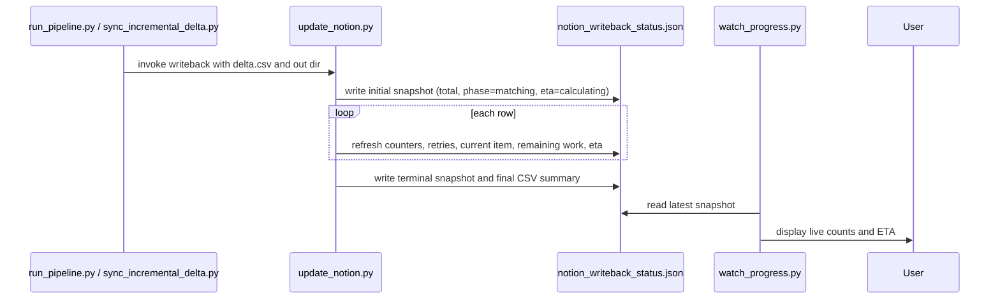

# feat: Add live Notion writeback status

## Overview

The Notion writeback flow currently gives a final count at the end of the run, but it does not answer the three questions that matter while a writeback is in progress:

- How many records need an update?
- What stage is the run in right now?
- How long is left?

This plan makes `update_notion.py` emit durable progress snapshots while it writes, teaches `watch_progress.py` to read those snapshots live, and keeps the existing CSV outputs for backward compatibility.

## Problem Frame

The current flow is good at matching rows and good at retrying transient Notion failures, but it is weak at observability:

- There is no machine-readable live status artifact.
- The only stable writeback summary appears after the run finishes.
- A partial failure leaves console output, but not enough structured state to tell whether the run was matching, writing, retrying, or done.
- `watch_progress.py` already surfaces pipeline status, but it only understands the older summary/log files.

The user wants a writeback that is robust enough to answer operational questions mid-run without guessing.

## Requirements Trace

- R1. Show how many rows need a Notion update before the first patch attempt begins.
- R2. Surface live writeback status while the run is active, including phase, counts, retries, remaining work, and ETA.
- R3. Keep the writeback resilient to Notion rate limits, retryable 5xxs, and interruptions.
- R4. Preserve the existing dry-run mode and the current CSV outputs used by the rest of the repo.
- R5. Make the live status visible through the repo’s existing progress viewer rather than requiring a new tool.

## Scope Boundaries

- No changes to scoring, delta generation, or duplicate-selection logic unless a status field needs data already present there.
- No changes to the Notion schema or matching precedence.
- No new background service, queue, or daemon.
- No redesign of the console UI beyond surfacing clearer progress and ETA.

### Deferred to Separate Tasks

- Historical dashboards or time-series analytics for writeback runs.
- Automatic resume from an interrupted checkpoint, unless it becomes necessary after implementation reveals a gap.

## Context & Research

### Relevant Code and Patterns

- `update_notion.py` already owns Notion lookups, matching, retries, and the final `notion_writeback_summary.csv` / `notion_writeback_log.csv` outputs.
- `watch_progress.py` already reads writeback summary and log files, so it is the right place to surface live status.
- `sync_incremental_delta.py` already snapshots growing CSV input before downstream consumers read it, which is a useful pattern for durable progress artifacts.
- `run_pipeline.py` is the top-level entrypoint that should stay aligned with any new status artifact naming.
- `notion_dedupe_cleanup.py` shows the current Notion retry/pacing style used elsewhere in the repo.

### Institutional Learnings

- No matching `docs/solutions/` entry was found in this repo.

### External References

- Notion’s official docs currently document `Notion-Version: 2026-03-11` as the latest supported version.
- Official auth docs: https://developers.notion.com/reference/authentication

## Key Technical Decisions

- Use `delta_updates.csv` as the authoritative source for “how many records need an update,” and publish that number in the initial status snapshot before any write begins.
- Add a machine-readable live status artifact, preferably a JSON snapshot rewritten atomically, so the watcher can read a stable view mid-run.
- Keep the existing summary CSV and row log as backward-compatible outputs, but enrich the summary with phase, elapsed time, retries, and remaining work.
- Compute ETA from observed throughput, but keep it conservative and allow an early “calculating” state until enough samples exist.
- Make the watcher understand both the full pipeline and the incremental-sync layout so the live status works regardless of how the Notion update was launched.

## Open Questions

### Resolved During Planning

- Status format: a JSON snapshot for live state plus the existing CSV summary/log artifacts.
- Count source: the number of rows in `delta_updates.csv` is the count of records that need an update.
- Visibility target: `watch_progress.py` should remain the primary live status surface.

### Deferred to Implementation

- The exact smoothing window for ETA.
- The minimum sample count before ETA becomes numeric instead of “calculating.”
- Whether the watcher should show per-row or per-batch progress when both are available.

## High-Level Technical Design

> *This illustrates the intended approach and is directional guidance for review, not implementation specification. The implementing agent should treat it as context, not code to reproduce.*

## Implementation Units

- [ ] **Unit 1: Add a shared writeback status contract**

**Goal:** Introduce a shared status shape and helper functions so the writer and watcher agree on the same live-state fields.

**Requirements:** R1, R2, R3, R4

**Dependencies:** Existing `update_notion.py` write loop and final summary outputs.

**Files:**
- Create: `writeback_status.py`
- Modify: `update_notion.py`
- Test: `test_writeback_status.py`

**Approach:**
- Extract the live-state fields into a small shared helper module instead of duplicating ETA and snapshot logic in two places.
- Track phase, total candidates, completed rows, updated rows, skipped rows, retries, last error, elapsed time, and estimated remaining time.
- Write the snapshot atomically so `watch_progress.py` never reads a half-written file.
- Update the status before the loop starts, after each row decision, after retryable failures, and at finalization.

**Execution note:** Characterization-first around the current summary and retry behavior before changing the write loop.

**Patterns to follow:**
- `sync_incremental_delta.py` snapshot handling for partially written CSV input.
- `notion_dedupe_cleanup.py` retry and pacing style around `NotionClient`.

**Test scenarios:**
- Happy path: initializing status for a 25-row delta reports 25 total rows, 0 completed rows, and 25 remaining rows.
- Happy path: a successful update increments `updated` and decrements `remaining`.
- Edge case: unmatched and ambiguous rows increment their own counters without changing `updated`.
- Error path: retryable Notion failures increment retry counters and preserve the current row as in-progress rather than completed.
- Edge case: atomic snapshot writing leaves a readable status file if the process is interrupted between updates.

**Verification:**
- The writer and watcher can both read the same status contract, and the final summary agrees with the live snapshot counters.

- [ ] **Unit 2: Surface live status in the progress viewer**

**Goal:** Make `watch_progress.py` show the new live writeback state, including ETA and the number of rows still needing updates.

**Requirements:** R2, R4, R5

**Dependencies:** Unit 1 status contract.

**Files:**
- Modify: `watch_progress.py`
- Modify: `run_pipeline.py`
- Modify: `sync_incremental_delta.py`
- Modify: `README.md`
- Test: `test_watch_progress.py`

**Approach:**
- Teach the watcher to prefer the live status snapshot when it exists, then fall back to the summary CSVs when it does not.
- Normalize the Notion output directory detection so the viewer works for both the full pipeline and the incremental sync flow.
- Render the current phase, rows needing update, completed rows, retries, and ETA in a way that is useful during a long run, not just at the end.
- Document the new status location and the meaning of the live fields in `README.md`.

**Patterns to follow:**
- `watch_progress.py` existing summary/log rendering.
- `run_pipeline.py` and `sync_incremental_delta.py` current orchestration layout.

**Test scenarios:**
- Happy path: when a live status file exists, the watcher prints the current phase, counts, and ETA.
- Edge case: when only the final CSV summary exists, the watcher still renders the previous behavior.
- Edge case: the viewer handles both `04_notion` and `04_notion_sync` layouts without requiring a new CLI.
- Integration: the top-level pipeline and the incremental sync path both leave the status artifact where the watcher expects it.

**Verification:**
- A run can be monitored while it is active, and the user can tell how many rows still need work without waiting for completion.

- [ ] **Unit 3: Harden failure reporting and rerun safety**

**Goal:** Make interrupted runs diagnosable and safe to rerun without losing context about what succeeded before the failure.

**Requirements:** R2, R3, R4

**Dependencies:** Unit 1 status contract and the existing Notion client retry behavior.

**Files:**
- Modify: `update_notion.py`
- Test: `test_update_notion_writeback.py`

**Approach:**
- Record the last successful row, the last error, and the retry budget usage in the live snapshot so failures are visible immediately.
- Keep the final summary and row log consistent even if a writeback stops mid-run.
- Preserve rerun safety by treating the delta input as the source of truth and keeping writes idempotent.
- Avoid optimistic ETA reporting after a failure; the snapshot should clearly indicate a failed or interrupted terminal state.

**Patterns to follow:**
- Existing `update_notion.py` retry loop and `NotionClient._handle` retryable error mapping.
- Existing writeback CSV summaries under `out/` or `run_output/`.

**Test scenarios:**
- Happy path: a clean run ends with a terminal success snapshot and matching summary/log totals.
- Error path: a forced fatal Notion error writes a failed terminal snapshot with the last error captured.
- Error path: a retryable response updates retry counters but does not mark the row complete until the patch succeeds.
- Integration: rerunning after an interrupted attempt starts from a fresh snapshot and does not corrupt existing log artifacts.

**Verification:**
- The writeback leaves enough structured state to inspect what happened without depending on console output.

## System-Wide Impact

- **Interaction graph:** `run_pipeline.py` and `sync_incremental_delta.py` both invoke `update_notion.py`, and `watch_progress.py` reads the artifacts they produce.
- **Error propagation:** transient Notion failures should continue to retry inside `NotionClient`, while fatal failures should surface in the snapshot and final summary.
- **State lifecycle risks:** partial writes, stale snapshots, and inconsistent counts between live status and final CSVs are the main hazards.
- **API surface parity:** the dry-run and real-writeback paths should expose the same progress fields, even if one never patches Notion.
- **Integration coverage:** the watcher needs at least one end-to-end scenario that proves it can read a live snapshot while the writer is still running.
- **Unchanged invariants:** the matching precedence stays `Raw ID` first, `Best Email` second; the Notion schema stays unchanged; and the existing CSV artifacts remain available for downstream tooling.

## Risks & Dependencies

| Risk | Mitigation |
|------|------------|
| ETA is misleading early in the run because throughput is still warming up | Show “calculating” until enough samples exist, then switch to a conservative rolling estimate |
| Live snapshot writes become a new failure point | Write atomically and keep the final CSV summary as a fallback source of truth |
| Watcher logic diverges between full and incremental pipelines | Centralize the status contract and make the viewer detect both output layouts |
| Existing downstream tooling depends on the current CSV names | Preserve `notion_writeback_log.csv` and `notion_writeback_summary.csv` while adding the live snapshot |

## Documentation / Operational Notes

- Update the README with the new live status artifact, the fields it exposes, and how to interpret ETA.
- Make the live status location explicit so a user can tail or inspect the current run without guessing the output directory.
- Keep the old summary artifacts intact for manual inspection and ad hoc automation.

## Sources & References

- **Related code:** `update_notion.py`
- **Related code:** `watch_progress.py`
- **Related code:** `sync_incremental_delta.py`
- **Related code:** `run_pipeline.py`
- **Related code:** `notion_dedupe_cleanup.py`
- **Related code:** `README.md`
- **External docs:** https://developers.notion.com/reference/authentication
